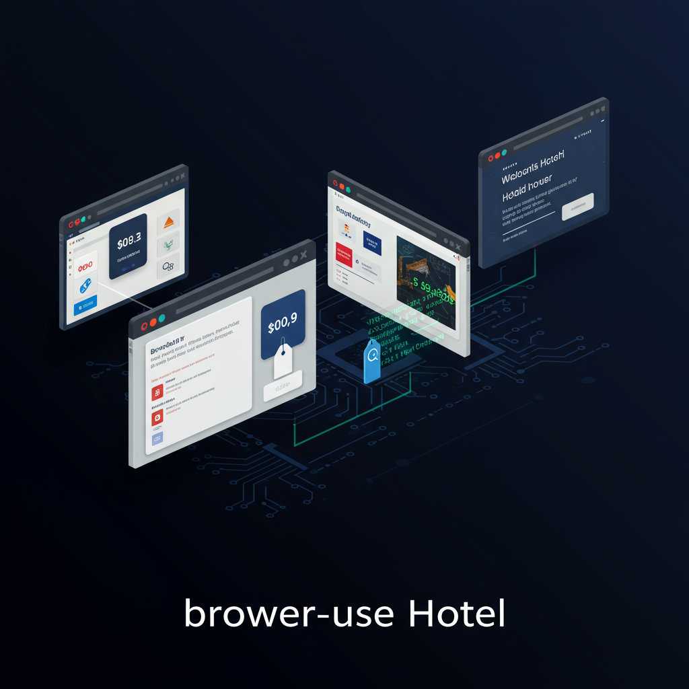

<p align="center">
  
</p>

<h1 align="center">browser-use-hotel</h1>

<p align="center">
  <b>AI Browser Agent 自动操控浏览器，实时搜索携程、去哪儿、同程三大酒店平台，截图直播比价</b>
</p>

<p align="center">
  <a href="https://hotel.rxcloud.group">Live Demo</a> ·
  <a href="#demo">Demo</a> ·
  <a href="#architecture">Architecture</a> ·
  <a href="#quick-start">Quick Start</a>
</p>

<p align="center">
  
  
  
  
  
</p>

---

## Demo

### 1. 搜索表单 — 输入酒店名称和入住日期


### 2. CRT 终端启动动画 — 三个 AI Agent 同时初始化


### 3. 实时截图推送 — Agent 操控 Chromium 搜索酒店


---

## How It Works

<p align="center">
  
</p>

```
用户输入酒店名 + 日期
        │
        ▼
  ┌───────────┐     INSERT task      ┌──────────────┐
  │  Next.js  │ ──────────────────▶  │   Supabase   │
  │  Frontend │                      │  PostgreSQL   │
  │  (Vercel) │ ◀── poll every 3s ── │  + Storage   │
  └───────────┘                      └──────┬───────┘
                                            │
                                     poll pending tasks
                                            │
                                     ┌──────▼───────┐
                                     │    Worker     │
                                     │  (Railway)    │
                                     │               │
                                     │  ┌─────────┐  │
                                     │  │ Agent 1 │──│──▶ 携程 hotels.ctrip.com
                                     │  ├─────────┤  │
                                     │  │ Agent 2 │──│──▶ 去哪儿 hotel.qunar.com
                                     │  ├─────────┤  │
                                     │  │ Agent 3 │──│──▶ 同程 www.ly.com
                                     │  └─────────┘  │
                                     └───────────────┘
                                            │
                                  screenshots + step_logs
                                     + results → DB
```

---

## Architecture

<p align="center">
  
</p>

| Layer | Technology | Deployment |
|:------|:-----------|:-----------|
| **Frontend** | Next.js 16, Tailwind CSS, TypeScript | [Vercel](https://vercel.com) |
| **Database** | Supabase (PostgreSQL + Storage) | [Supabase](https://supabase.com) |
| **Worker** | Python 3.12, [browser-use](https://github.com/browser-use/browser-use) v0.12, Playwright | [Railway](https://railway.com) |
| **LLM** | GLM-4-Plus (OpenAI-compatible API) | [ZhiPu AI](https://open.bigmodel.cn) |

```
hotel-compare/
├── web/                          # Next.js 前端
│   ├── app/page.tsx              # 主页 — 轮询 Supabase 展示实时数据
│   ├── components/
│   │   ├── SearchForm.tsx        # 搜索表单 → 创建 task
│   │   ├── PlatformCard.tsx      # 平台卡片（截图流 + 状态指示）
│   │   ├── BootAnimation.tsx     # CRT 启动动画（扫描线 + 磷光绿）
│   │   └── ComparisonTable.tsx   # 最终比价结果表格
│   └── lib/
│       ├── supabase.ts           # Supabase client
│       └── types.ts              # StepLog / Result 类型定义
│
├── browser-use-version/          # Python Worker（服务端 Agent）
│   ├── worker.py                 # 轮询任务队列，逐个执行
│   ├── hotel_compare.py          # 3 平台搜索 prompt + 价格解析
│   ├── supabase_client.py        # DB / Storage 操作封装
│   └── Dockerfile                # Railway 部署镜像
│
├── page-agent-version/           # Chrome Extension Agent（客户端方案）
│
└── supabase/
    └── migrations/               # SQL schema
```

---

## Key Features

<table>
<tr>
<td width="50%">

**CRT Boot Animation**


复古终端风格开机动画，磷光绿文字 + 扫描线效果，每个平台独立显示初始化进度。

</td>
<td width="50%">

**Screenshot Streaming**

Agent 控制 headless Chromium 执行搜索，每一步截图实时上传 Supabase Storage，前端 3 秒轮询拉取展示。

**Price Validation**

价格范围过滤（¥30 – ¥50,000），防止年份（2026）、日期（4/15）被误解析为酒店价格。正则兜底要求 ¥ 前缀。

**Error Isolation**

单平台 Agent 失败不影响其他平台。每个 Agent 独立 try/except，失败记录 error 到 results 表。

</td>
</tr>
</table>

---

## Quick Start

### Frontend

```bash
cd hotel-compare/web
npm install

# 配置 Supabase 连接
cat > .env.local << EOF
NEXT_PUBLIC_SUPABASE_URL=your_supabase_url
NEXT_PUBLIC_SUPABASE_ANON_KEY=your_anon_key
EOF

npm run dev    # → http://localhost:3000
```

### Worker

```bash
cd hotel-compare/browser-use-version
uv sync
uv run playwright install chromium

# 配置环境变量
cp .env.example .env
# 编辑 .env：SUPABASE_URL, SUPABASE_KEY, OPENAI_BASE_URL, OPENAI_MODEL

uv run python worker.py
```

### Database Schema

```sql
-- tasks: 搜索任务队列
CREATE TABLE tasks (
  id UUID DEFAULT gen_random_uuid() PRIMARY KEY,
  hotel TEXT NOT NULL,
  checkin DATE NOT NULL,
  checkout DATE NOT NULL,
  status TEXT DEFAULT 'pending'
    CHECK (status IN ('pending','running','completed','failed')),
  created_at TIMESTAMPTZ DEFAULT now()
);

-- step_logs: Agent 步骤日志 + 截图 URL
CREATE TABLE step_logs (
  id BIGINT GENERATED ALWAYS AS IDENTITY PRIMARY KEY,
  task_id UUID REFERENCES tasks(id),
  platform TEXT NOT NULL,
  step_num INT NOT NULL,
  goal TEXT,
  screenshot_url TEXT,
  created_at TIMESTAMPTZ DEFAULT now()
);

-- results: 最终比价结果
CREATE TABLE results (
  id BIGINT GENERATED ALWAYS AS IDENTITY PRIMARY KEY,
  task_id UUID REFERENCES tasks(id),
  platform TEXT NOT NULL,
  hotel_name TEXT,
  lowest_price NUMERIC,
  room_type TEXT,
  page_url TEXT,
  error TEXT,
  created_at TIMESTAMPTZ DEFAULT now()
);
```

---

## Two Engine Comparison

本项目用两种 Browser Agent 方案实现同一个酒店比价任务：

| | browser-use（服务端） | page-agent（客户端） |
|:---|:---|:---|
| **运行环境** | Python + Playwright（headless Chromium） | Chrome Extension（用户真实浏览器） |
| **LLM** | GLM-4-Plus (OpenAI-compatible API) | OpenAI API |
| **部署方式** | Railway Docker 容器 | 本地 Chrome 安装 |
| **可观测性** | 截图上传 + step_logs 数据库记录 | Console logs |
| **反爬能力** | headless 检测风险，需额外指纹伪装 | 真实用户浏览器环境，天然绕过检测 |
| **适用场景** | 全自动后台运行，支持队列化任务 | 需要用户在场，适合单次交互 |
| **代码位置** | `browser-use-version/` | `page-agent-version/` |

---

## License

MIT
