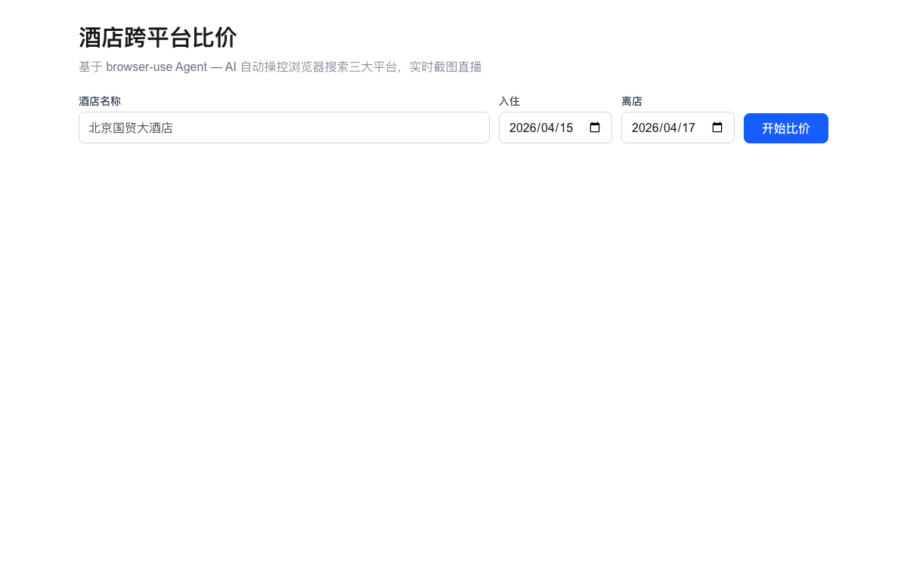
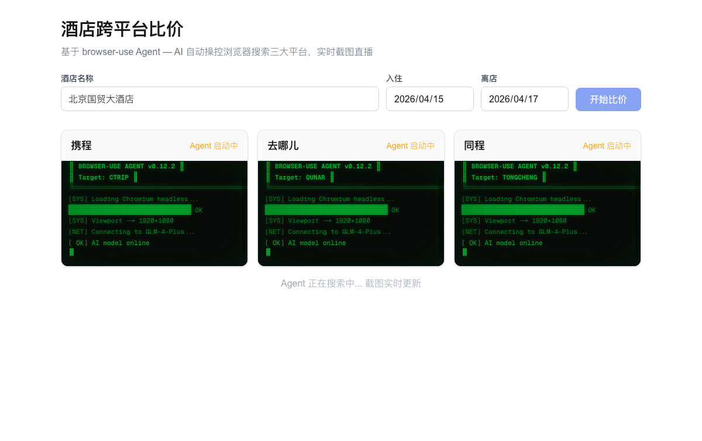
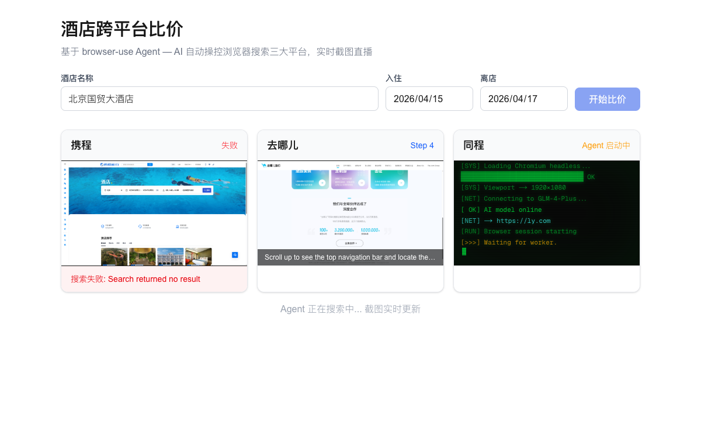
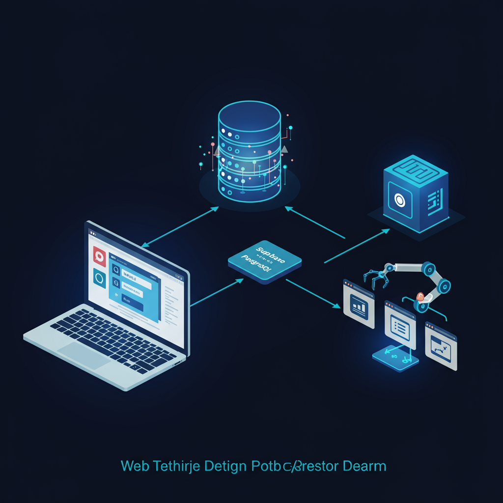

<p align="center">
  
</p>

# 酒店跨平台比价

AI Browser Agent 自动操控浏览器搜索携程/去哪儿/同程三大平台，实时截图直播比价。

**Live Demo**: [hotel.rxcloud.group](https://hotel.rxcloud.group)

---

## Screenshots

<table>
<tr>
<td align="center" width="33%">
<br/>
<b>搜索表单</b><br/>
<sub>输入酒店名称和日期</sub>
</td>
<td align="center" width="33%">
<br/>
<b>CRT 启动动画</b><br/>
<sub>三平台 Agent 同时初始化</sub>
</td>
<td align="center" width="33%">
<br/>
<b>实时截图推送</b><br/>
<sub>Agent 操控浏览器搜索中</sub>
</td>
</tr>
</table>

---

## Architecture

<p align="center">
  
</p>

```
Frontend (Next.js / Vercel)       Supabase (PostgreSQL)       Worker (Python / Railway)
      │                                  │                          │
      │── INSERT task ──────────────────▶│                          │
      │                                  │◀── poll pending ────────│
      │                                  │─── mark running ───────▶│
      │                                  │                          │── browser-use Agent
      │                                  │◀── step_logs ───────────│   (headless Chromium)
      │◀── poll 3s ─────────────────────│◀── screenshots ─────────│
      │                                  │◀── results ─────────────│
      │◀── poll 3s ─────────────────────│                          │
```

| Layer | Stack | Deployment |
|:------|:------|:-----------|
| Frontend | Next.js 16 + Tailwind CSS | Vercel |
| Database | Supabase (PostgreSQL + Storage) | Supabase Cloud |
| Worker | Python 3.12 + browser-use + Playwright | Railway |
| LLM | GLM-4-Plus (OpenAI-compatible) | ZhiPu AI |

---

## Features

- **CRT Boot Animation** — 复古终端风格启动动画，磷光绿扫描线效果
- **Screenshot Streaming** — headless Chromium 截图实时上传，前端 3 秒轮询展示
- **Price Validation** — 价格范围过滤 ¥30–50,000，防止年份/日期误解析
- **Error Isolation** — 单平台失败不影响其他平台，独立 try/except
- **Structured Output** — Pydantic BaseModel 解析 + JSON 正则兜底

---

## Local Development

### Frontend

```bash
cd web
cp .env.local.example .env.local  # Set NEXT_PUBLIC_SUPABASE_URL and KEY
npm install && npm run dev
```

### Worker

```bash
cd browser-use-version
cp .env.example .env  # Set SUPABASE_URL, SUPABASE_KEY, OPENAI_BASE_URL, OPENAI_MODEL
uv sync && uv run playwright install chromium
uv run python worker.py
```

---

## Two Engine Comparison

| Dimension | browser-use (server) | page-agent (client) |
|:----------|:---------------------|:--------------------|
| Runtime | Python + Playwright (headless) | Chrome Extension (user browser) |
| LLM | GLM-4-Plus via API | OpenAI API |
| Deployment | Railway (Docker) | Local Chrome |
| Observability | Screenshots + step logs | Console logs |
| Anti-bot | Headless detection risk | Real user browser |
